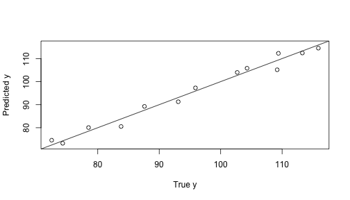

## Introductions 

1. This application is to perform linear regression using data set cement 

2. It is given to illustrate the accuracy for different combinations of predictors 

3. Only two variables x1,x2 are selected to predict y using linear model 

4. There are several user interactive features developped

5. User interface is defined in ui.R

6. The function is defined in server.R

7. Application Documentation is given in Documentation.Rmd

--- .class #id

## Features to hightlight 

1. The figure rendered depends on the user input

2. Select the the predictor using Checkbox (x1,x2)

3. Specify the level of confidence (0.6-0.99)

4. Choose whether to plot the confidence interval (Yes, No)

5. The x axis is the true y value, yaxis the predited y value

6. The lightblue shade is the confidence interval specified by the user 

7. The black line is the ground truth for comparison. If the predicted values match the true ones, the data points will fall on this line exactly.

--- .class #id 

## Demonstration 1 
1.Checkbox: x1, x2;
2.Confidence Interval plot: No;
3.Confidence Interval Level: Not effective on figure


```r
data(cement)
model <- lm(y ~ x1 +  x2, data=cement)
pred <- predict(model,newdata =data.frame(x1=cement$x1,x2=cement$x2),interval="confidence")
plot(cement$y,pred[,1],xlim=c(min(cement$y),max(cement$y)),ylim=c(min(cement$y),max(cement$y)),
     xlab="True y",ylab="Predicted y")
abline(0,1)
```



---.class #id 

## Demonstration 2
1. Checkbox: x1, x2 
2. Confidence Interval plot: Yes 
3. Confidence Interval Level: 0.9


---


